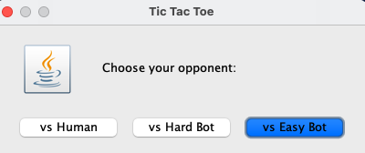
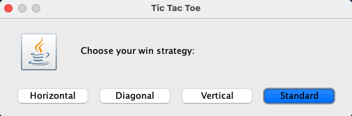
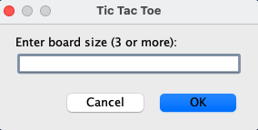
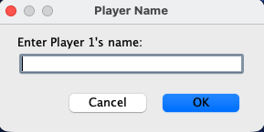
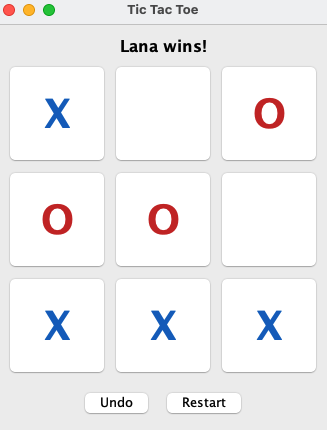
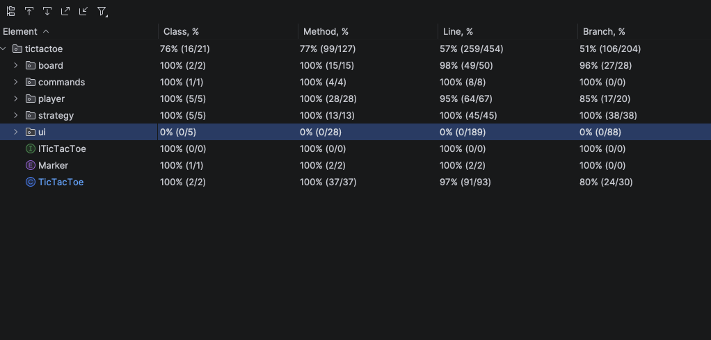

# CSCI4448 Project - Tic Tac Toe

        Names: Lana Reeves and Samuel Hagen
        Java Version: 25

## Project Description:
- This project built a two-player Tic-Tac-Toe game, where the user can choose if they want to play against an easy bot, hard bot, or another person. The human player can choose the way you win the game (Standard, Horizontal, Vertical, or Diagonal).
The game UI will have a $m x m$ Tic-Tac-Toe board where the user enters the size of the game board. Each player will be able to place their X or O in a cell. The players will each get assigned a marker (X or O), and for all human players, clicking on a cell during their turn will place the player’s marker on the board. The game will detect if there is a win or a tie.

## Design Patterns 
- Factory Pattern:
  - The factory pattern was used to create instances of different types of players and win strategies.
  - The PlayerFactory is used to create either a Human, Easy Bot, or Hard Bot Player. The Player Factory is injected into the TicTacToe builder.
  - The StrategyFactory is used to create the different win strategies (Standard, Horizontal, Vertical, or Diagonal).
- Builder Pattern:
  - The builder pattern was used to create a TicTacToe game instance. 
  - It allows step by step creation of the game with different types of players, setting the board size, and setting the win strategy without the need for many/large constructors.
- Strategy Pattern
  - We use the strategy pattern to give the game different ways to be won.
  - We have the four different win strategies of Standard, Horizontal, Vertical, or Diagonal.
  - Instead of hardcoding the win logic into one class we encapsulated the code into separate win strategy classes that all implement the IWinStrategy interface.
- Command Pattern
  - We implemented the command pattern to encapsulate the player's move as an object, so we could easily implement an undo feature.
  - Each move in the game is a move command that implements the ICommand interface. For each move, instead of directly updating the board, the game creates a move command and calls execute. This command is stored in a list so the undo method can be called on it to reverse the move.

## UI Example

## Test Coverage

UI test coverage is not completed because we were told it was not required

